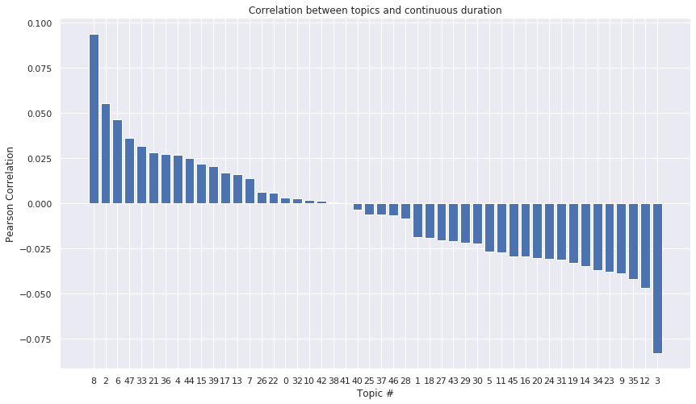
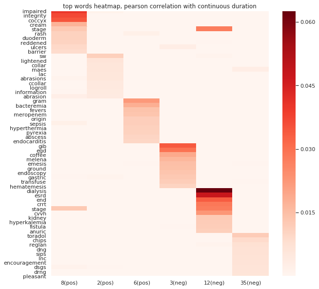
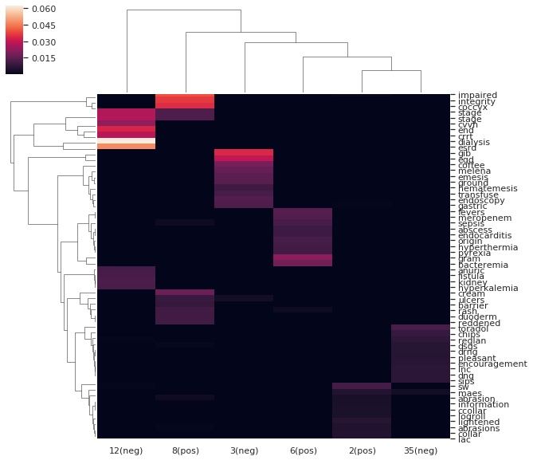
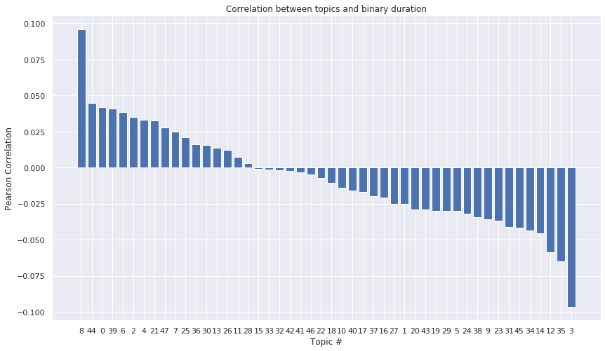
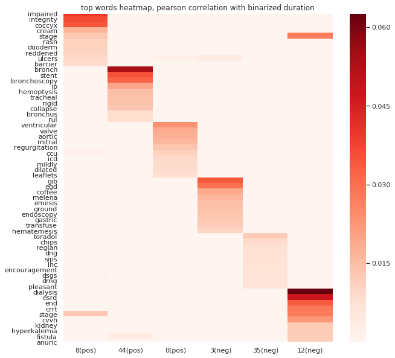
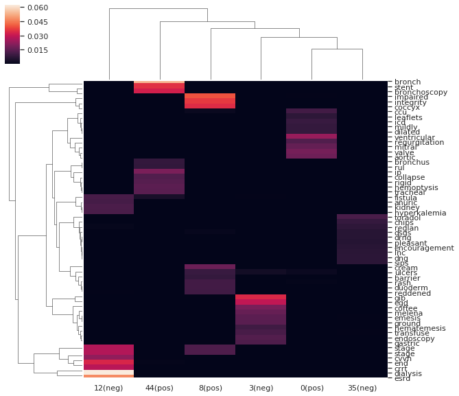
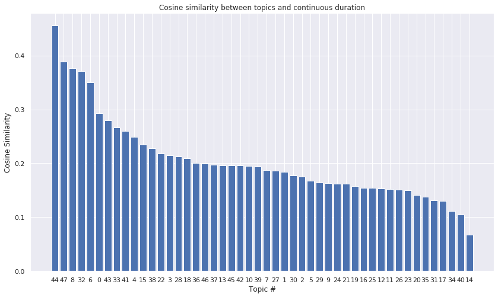
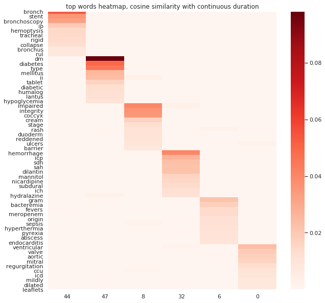
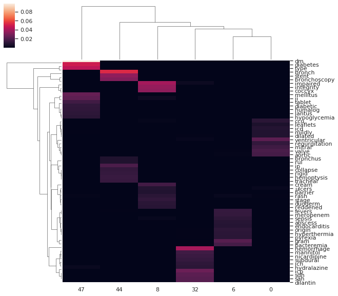
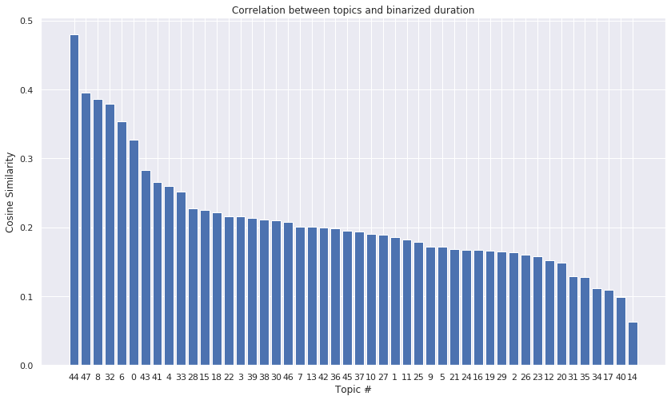

# Correlate topic mixtures from MixEHR with ventilation duration


## Importing libraries
```python
import pandas as pd
import numpy as np
import matplotlib.pyplot as plt
from sklearn.preprocessing import normalize
import seaborn as sns
%matplotlib inline
```

## Read data


```python
mixtures = pd.read_csv('/home/mcb/li_lab/zwen8/data/mimic/d2_phy_nurse_48/infer/infer_result.csv', header=None)
duration = pd.read_csv('/home/mcb/li_lab/zwen8/data/mimic/d2_phy_nurse_48/vent.txt', header=None, sep=' ')
duration = duration[1].astype(np.float64)
```


```python
print(duration.shape)
print(mixtures.shape)
```

    (7289,)
    (7289, 50)

Duration is (# of admissions, ), mixtures is (# of admissions, # of topics).

## Normalize topic mixtures


```python
normed_mixtures = pd.DataFrame(normalize(mixtures.iloc[:,2:51], norm='l1', axis=1))
```


See if mixture's rows sum up to 1


```python
normed_mixtures.sum(axis=1)
```


    0       1.0
    1       1.0
    2       1.0
    3       1.0
    4       1.0
           ... 
    7284    1.0
    7285    1.0
    7286    1.0
    7287    1.0
    7288    1.0
    Length: 7289, dtype: float64


## Compute Pearson correlation


```python
corr = normed_mixtures.apply(lambda mixture: mixture.corr(duration, method='pearson'))
```


```python
corr_sorted = corr.sort_values(ascending=False)
```


```python
plt.figure(figsize=(14, 8))
plt.bar(x=range(len(corr)), height=corr_sorted)
plt.title('Correlation between topics and continuous duration')
plt.xlabel('Topic #')
plt.xticks(range(len(corr)), corr_sorted.index)
plt.ylabel('Pearson Correlation')
```


    Text(0, 0.5, 'Pearson Correlation')





## Select most correlated topics and map back to words


```python
def find_max_n(numbers, n=3):
    sorted_numbers = sorted(numbers, reverse=True)
    return [numbers.index(number) for number in sorted_numbers[0:n]]
```


```python
top_pos = find_max_n(list(corr), 3)
top_neg = find_max_n(list(-corr), 3)
```

Pick 3 most positively and negatively correlated topics


```python
top_topics = top_pos + top_neg
top_topics
```


    [8, 2, 6, 3, 12, 35]


## Extract top words in those top topics

Read topic's mixtures.
```python
phis_df = pd.read_csv(r'/home/mcb/li_lab/zwen8/data/mimic/all_notes_nosws_train_mixehr/data_JCVB0_nmar_K50_iter632_phi_normalized.csv', header=None)
```
Here `phis_df` is (size of vocabulary, # of topics)

```python
phis_df.columns = ['PLACE_HOLD', 'WORD_ID'] + [str(idx) for idx in range(50)]
```

```python
cols = ['WORD_ID'] + [str(value) for value in top_topics]
```
Extract top topics' mixtures

```python
top_phis_df = phis_df[cols]
```

Read vocabulary
```python
vocab_df = pd.read_csv(r'/home/mcb/li_lab/zwen8/data/mimic/all_notes_nosws_train_mixehr/vocab.txt', header=None)
```
Extract top 10 words in each top topics

```python
top_words_bytopic = [top_phis_df.sort_values(by=str(topic), ascending=False)['WORD_ID'][0:10] for topic in top_topics]
top_words = []
for sublist in top_words_bytopic:
    for word in sublist:
        top_words.append(word)
```


```python
word_topic_matrix = top_phis_df.iloc[[word_id for word_id in top_words]]
```
Plot heatmap

```python
yticklabels = [vocab_df[vocab_df['WORD_ID'] == word_id]['WORD'].values[0] for word_id in top_words]
# xticklabels = ['23(pos)', '8(pos)', '36(pos)', '42(neg)', '17(neg)', '16(neg)']
xticklabels = [str(topic) + '(pos)' for topic in top_topics[0:3]] + [str(topic) + '(neg)' for topic in top_topics[3:]]
```


```python
plt.figure(figsize=(10,10))
sns.heatmap(word_topic_matrix.iloc[:, 1:], yticklabels=yticklabels, xticklabels=xticklabels, cmap='Reds')
plt.title('top words heatmap, pearson correlation with continuous duration')
```


    Text(0.5, 1, 'top words heatmap, pearson correlation with continuous duration')





And clustermap
```python
sns.set()
sns.clustermap(word_topic_matrix.iloc[:, 1:], yticklabels=yticklabels, xticklabels=xticklabels)
```


    <seaborn.matrix.ClusterGrid at 0x7ff0f8d6c6d8>





## Binary duration
Thresholding at 7 day. Same operations as above.


```python
binary_duration = (duration > 7 * 24).astype(int)
```


```python
bi_corr = normed_mixtures.apply(lambda mixture: mixture.corr(binary_duration, method='pearson'))
```


```python
bi_corr_sorted = bi_corr.sort_values(ascending=False)
```


```python
plt.figure(figsize=(14,8))
plt.bar(x=range(len(bi_corr)), height=bi_corr_sorted)
plt.title('Correlation between topics and binary duration')
plt.xlabel('Topic #')
plt.xticks(range(len(bi_corr)), bi_corr_sorted.index)
plt.ylabel('Pearson Correlation')
```


    Text(0, 0.5, 'Pearson Correlation')





## Select most correlated topics and map back to words


```python
bi_top_topics = find_max_n(list(np.abs(bi_corr)), 6)
```


```python
bi_top_pos = find_max_n(list(bi_corr), 3)
bi_top_neg = find_max_n(list(-bi_corr), 3)
```


```python
bi_top_topics = bi_top_pos + bi_top_neg
```


## Extract top words in those top topics


```python
bi_cols = ['WORD_ID'] + [str(value) for value in bi_top_topics]
```


```python
bi_top_phis_df = phis_df[bi_cols]
```


```python
vocab_df = pd.read_csv(r'/home/mcb/li_lab/zwen8/data/mimic/all_notes_nosws_train_mixehr/vocab.txt', header=None)
```


```python
vocab_df.columns = ['WORD', 'WORD_ID']
```

```python
bi_top_words_bytopic = [bi_top_phis_df.sort_values(by=str(topic), ascending=False)['WORD_ID'][0:10] for topic in bi_top_topics]
bi_top_words = []
for sublist in bi_top_words_bytopic:
    for word in sublist:
        bi_top_words.append(word)
```


```python
bi_word_topic_matrix = bi_top_phis_df.iloc[[word_id for word_id in bi_top_words]]
```

```python
vocab_df.shape
```


    (29689, 2)

There are 29689 'words' in the vocabulary.


```python
bi_yticklabels = [vocab_df[vocab_df['WORD_ID'] == word_id]['WORD'].values[0] for word_id in bi_top_words]
bi_xticklabels = [str(topic) + '(pos)' for topic in bi_top_topics[0:3]] + [str(topic) + '(neg)' for topic in bi_top_topics[3:]]
```


```python
plt.figure(figsize=(10,10))
sns.heatmap(bi_word_topic_matrix.iloc[:, 1:], yticklabels=bi_yticklabels, xticklabels=bi_xticklabels, cmap='Reds')
plt.title('top words heatmap, pearson correlation with binarized duration')
```


    Text(0.5, 1, 'top words heatmap, pearson correlation with binarized duration')





```python
sns.set()
sns.clustermap(bi_word_topic_matrix.iloc[:, 1:], yticklabels=bi_yticklabels, xticklabels=bi_xticklabels)
```


    <seaborn.matrix.ClusterGrid at 0x7ff0f87bf470>





## Try using cosine similarity instead of Pearson correlation
Because the correlation might not be linear. Same operations.


```python
def cosine(series_1, series_2):
    return np.dot(series_1, series_2) / (np.linalg.norm(series_1, ord=2) * np.linalg.norm(series_2, ord=2))
```

Compute cosine similarity
```python
cos = normed_mixtures.corrwith(duration, method=cosine)
```


```python
cos_sorted = cos.sort_values(ascending=False)
```


```python
plt.figure(figsize=(14, 8))
plt.bar(x=range(len(cos_sorted)), height=cos_sorted)
plt.title('Cosine similarity between topics and continuous duration')
plt.xlabel('Topic #')
plt.xticks(range(len(cos_sorted)), cos_sorted.index)
plt.ylabel('Cosine Similarity')
```


    Text(0, 0.5, 'Cosine Similarity')





## Select most correlated topics and map back to words


```python
def find_max_n(numbers, n=3):
    sorted_numbers = sorted(numbers, reverse=True)
    return [numbers.index(number) for number in sorted_numbers[0:n]]
```


```python
cos_top_topics = find_max_n(list(cos), 6)
```

## Extract top words in those top topics


```python
cos_cols = ['WORD_ID'] + [str(value) for value in cos_top_topics]
```


```python
cos_top_phis_df = phis_df[cos_cols]
```

```python
cos_top_words_bytopic = [cos_top_phis_df.sort_values(by=str(topic), ascending=False)['WORD_ID'][0:10] for topic in cos_top_topics]
cos_top_words = []
for sublist in cos_top_words_bytopic:
    for word in sublist:
        cos_top_words.append(word)
```


```python
cos_word_topic_matrix = cos_top_phis_df.iloc[[word_id for word_id in cos_top_words]]
```


```python
cos_yticklabels = [vocab_df[vocab_df['WORD_ID'] == word_id]['WORD'].values[0] for word_id in cos_top_words]
cos_xticklabels = [str(topic) for topic in cos_top_topics]
```


```python
plt.figure(figsize=(10,10))
sns.heatmap(cos_word_topic_matrix.iloc[:, 1:], yticklabels=cos_yticklabels, xticklabels=cos_xticklabels, cmap='Reds')
plt.title('top words heatmap, cosine similarity with continuous duration')
```


    Text(0.5, 1, 'top words heatmap, cosine similarity with continuous duration')





```python
sns.set()
sns.clustermap(cos_word_topic_matrix.iloc[:, 1:], yticklabels=cos_yticklabels, xticklabels=cos_xticklabels)
```


    <seaborn.matrix.ClusterGrid at 0x7ff0f85974e0>





### Cosine similarity with binarized duration


```python
bi_cos = normed_mixtures.apply(lambda mixture: mixture.corr(binary_duration, method=inner_prod))
```


```python
bi_cos_sorted = bi_cos.sort_values(ascending=False)
```


```python
plt.figure(figsize=(14, 8))
plt.bar(x=range(len(bi_cos_sorted)), height=bi_cos_sorted)
plt.title('Correlation between topics and binarized duration')
plt.xlabel('Topic #')
plt.xticks(range(len(bi_cos_sorted)), bi_cos_sorted.index)
plt.ylabel('Cosine Similarity')
```


    Text(0, 0.5, 'Cosine Similarity')





## Select most correlated topics and map back to words


```python
bi_cos_top_topics = find_max_n(list(bi_cos), 6)
```

## Extract top words in those top topics


```python
bi_cos_cols = ['WORD_ID'] + [str(value) for value in bi_cos_top_topics]
```


```python
bi_cos_top_phis_df = phis_df[bi_cos_cols]
```


```python
bi_cos_top_words_bytopic = [bi_cos_top_phis_df.sort_values(by=str(topic), ascending=False)['WORD_ID'][0:10] for topic in bi_cos_top_topics]
bi_cos_top_words = []
for sublist in bi_cos_top_words_bytopic:
    for word in sublist:
        bi_cos_top_words.append(word)
```


```python
bi_cos_word_topic_matrix = bi_cos_top_phis_df.iloc[[word_id for word_id in bi_cos_top_words]]
```

```python
bi_cos_yticklabels = [vocab_df[vocab_df['WORD_ID'] == word_id]['WORD'].values[0] for word_id in bi_cos_top_words]
bi_cos_xticklabels = [str(topic) for topic in bi_cos_top_topics]
```


```python
plt.figure(figsize=(10,10))
sns.heatmap(bi_cos_word_topic_matrix.iloc[:, 1:], yticklabels=bi_cos_yticklabels, xticklabels=bi_cos_xticklabels, cmap='Reds')
plt.title('top words heatmap, cosine similarity with binarized duration')
```


    Text(0.5, 1, 'top words heatmap, cosine similarity with binarized duration')


```python
sns.set()
sns.clustermap(bi_cos_word_topic_matrix.iloc[:, 1:], yticklabels=bi_cos_yticklabels, xticklabels=bi_cos_xticklabels)
```


    <seaborn.matrix.ClusterGrid at 0x7ff0f8492f60>


