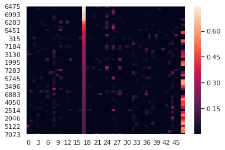
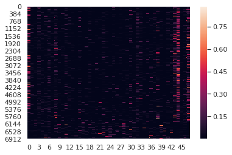

# Correlate topic mixtures from MixEHR with ventilation duration


```python
import pandas as pd
import numpy as np
import matplotlib.pyplot as plt
from sklearn.preprocessing import normalize
import seaborn as sns
%matplotlib inline
```

## Read data


```python
mixtures = pd.read_csv('/home/mcb/li_lab/zwen8/data/mimic/d2_phy_nurse_48/infer/infer_result.csv', header=None)
duration = pd.read_csv('/home/mcb/li_lab/zwen8/data/mimic/d2_phy_nurse_48/vent.txt', header=None, sep=' ')
duration = duration[1].astype(np.float64)
```


```python
print(duration.shape)
print(mixtures.shape)
```

    (7289,)
    (7289, 50)


```python
mixtures.head()
```


<div>
<style scoped>
    .dataframe tbody tr th:only-of-type {
        vertical-align: middle;
    }

    .dataframe tbody tr th {
        vertical-align: top;
    }

    .dataframe thead th {
        text-align: right;
    }
</style>
<table border="1" class="dataframe">
  <thead>
    <tr style="text-align: right;">
      <th></th>
      <th>0</th>
      <th>1</th>
      <th>2</th>
      <th>3</th>
      <th>4</th>
      <th>5</th>
      <th>6</th>
      <th>7</th>
      <th>8</th>
      <th>9</th>
      <th>...</th>
      <th>40</th>
      <th>41</th>
      <th>42</th>
      <th>43</th>
      <th>44</th>
      <th>45</th>
      <th>46</th>
      <th>47</th>
      <th>48</th>
      <th>49</th>
    </tr>
  </thead>
  <tbody>
    <tr>
      <td>0</td>
      <td>0.370623</td>
      <td>0.194906</td>
      <td>5.276102</td>
      <td>0.348726</td>
      <td>0.287782</td>
      <td>40.370226</td>
      <td>4.321131</td>
      <td>0.253114</td>
      <td>28.585385</td>
      <td>0.648867</td>
      <td>...</td>
      <td>23.497362</td>
      <td>0.139191</td>
      <td>0.396542</td>
      <td>19.933494</td>
      <td>0.330650</td>
      <td>40.009483</td>
      <td>39.129663</td>
      <td>3.229883</td>
      <td>0.107501</td>
      <td>14.370463</td>
    </tr>
    <tr>
      <td>1</td>
      <td>0.720793</td>
      <td>0.397904</td>
      <td>22.838857</td>
      <td>0.194343</td>
      <td>0.248401</td>
      <td>9.070775</td>
      <td>0.151571</td>
      <td>0.190460</td>
      <td>0.347712</td>
      <td>0.238685</td>
      <td>...</td>
      <td>0.476908</td>
      <td>0.211895</td>
      <td>0.095115</td>
      <td>0.299895</td>
      <td>0.125911</td>
      <td>3.265872</td>
      <td>63.192335</td>
      <td>0.311834</td>
      <td>2.544006</td>
      <td>23.524916</td>
    </tr>
    <tr>
      <td>2</td>
      <td>0.082270</td>
      <td>0.306322</td>
      <td>1.775423</td>
      <td>0.335247</td>
      <td>0.258639</td>
      <td>0.152633</td>
      <td>0.039467</td>
      <td>0.064208</td>
      <td>8.470015</td>
      <td>0.232681</td>
      <td>...</td>
      <td>0.222522</td>
      <td>0.065769</td>
      <td>0.040541</td>
      <td>0.031881</td>
      <td>0.096974</td>
      <td>1.887761</td>
      <td>11.758451</td>
      <td>0.034853</td>
      <td>0.163405</td>
      <td>55.247264</td>
    </tr>
    <tr>
      <td>3</td>
      <td>0.116614</td>
      <td>0.163569</td>
      <td>20.760071</td>
      <td>0.959721</td>
      <td>1.216958</td>
      <td>2.382869</td>
      <td>0.082922</td>
      <td>0.129344</td>
      <td>0.190247</td>
      <td>0.439190</td>
      <td>...</td>
      <td>7.887094</td>
      <td>0.150346</td>
      <td>0.128526</td>
      <td>0.187408</td>
      <td>0.134289</td>
      <td>3.472641</td>
      <td>45.142103</td>
      <td>0.262518</td>
      <td>79.710551</td>
      <td>9.874938</td>
    </tr>
    <tr>
      <td>4</td>
      <td>0.374715</td>
      <td>0.157828</td>
      <td>0.761102</td>
      <td>0.083880</td>
      <td>0.131415</td>
      <td>0.222197</td>
      <td>1.377851</td>
      <td>0.200101</td>
      <td>0.304107</td>
      <td>0.258439</td>
      <td>...</td>
      <td>132.446895</td>
      <td>0.132357</td>
      <td>0.139894</td>
      <td>2.331493</td>
      <td>0.078898</td>
      <td>0.583116</td>
      <td>3.138759</td>
      <td>0.191520</td>
      <td>0.165349</td>
      <td>3.107429</td>
    </tr>
  </tbody>
</table>
<p>5 rows × 50 columns</p>
</div>


```python
duration.head()
```


    0     83.733333
    1    118.333333
    2     82.666667
    3    166.000000
    4     91.500000
    Name: 1, dtype: float64


## Normalize


```python
normed_mixtures = pd.DataFrame(normalize(mixtures.iloc[:,2:51], norm='l1', axis=1))
```


```python
mixtures.sum(axis=1)
```


    0        290.0
    1        193.0
    2        125.0
    3        269.0
    4        232.0
             ...  
    7284    1390.0
    7285     389.0
    7286    2918.0
    7287    2462.0
    7288    1465.0
    Length: 7289, dtype: float64


## See if mixture's rows sum up to 1


```python
normed_mixtures.sum(axis=1)
```


    0       1.0
    1       1.0
    2       1.0
    3       1.0
    4       1.0
           ... 
    7284    1.0
    7285    1.0
    7286    1.0
    7287    1.0
    7288    1.0
    Length: 7289, dtype: float64


## Heatmap


```python
normed_mixtures.head()
```


<div>
<style scoped>
    .dataframe tbody tr th:only-of-type {
        vertical-align: middle;
    }

    .dataframe tbody tr th {
        vertical-align: top;
    }

    .dataframe thead th {
        text-align: right;
    }
</style>
<table border="1" class="dataframe">
  <thead>
    <tr style="text-align: right;">
      <th></th>
      <th>0</th>
      <th>1</th>
      <th>2</th>
      <th>3</th>
      <th>4</th>
      <th>5</th>
      <th>6</th>
      <th>7</th>
      <th>8</th>
      <th>9</th>
      <th>...</th>
      <th>38</th>
      <th>39</th>
      <th>40</th>
      <th>41</th>
      <th>42</th>
      <th>43</th>
      <th>44</th>
      <th>45</th>
      <th>46</th>
      <th>47</th>
    </tr>
  </thead>
  <tbody>
    <tr>
      <td>0</td>
      <td>0.018229</td>
      <td>0.001205</td>
      <td>0.000994</td>
      <td>0.139480</td>
      <td>0.014930</td>
      <td>0.000875</td>
      <td>0.098763</td>
      <td>0.002242</td>
      <td>0.018165</td>
      <td>0.003874</td>
      <td>...</td>
      <td>0.081184</td>
      <td>0.000481</td>
      <td>0.001370</td>
      <td>0.068870</td>
      <td>0.001142</td>
      <td>0.138233</td>
      <td>0.135194</td>
      <td>0.011159</td>
      <td>0.000371</td>
      <td>0.049650</td>
    </tr>
    <tr>
      <td>1</td>
      <td>0.119026</td>
      <td>0.001013</td>
      <td>0.001295</td>
      <td>0.047273</td>
      <td>0.000790</td>
      <td>0.000993</td>
      <td>0.001812</td>
      <td>0.001244</td>
      <td>0.013697</td>
      <td>0.002431</td>
      <td>...</td>
      <td>0.002485</td>
      <td>0.001104</td>
      <td>0.000496</td>
      <td>0.001563</td>
      <td>0.000656</td>
      <td>0.017020</td>
      <td>0.329330</td>
      <td>0.001625</td>
      <td>0.013258</td>
      <td>0.122601</td>
    </tr>
    <tr>
      <td>2</td>
      <td>0.014248</td>
      <td>0.002690</td>
      <td>0.002076</td>
      <td>0.001225</td>
      <td>0.000317</td>
      <td>0.000515</td>
      <td>0.067971</td>
      <td>0.001867</td>
      <td>0.147567</td>
      <td>0.000433</td>
      <td>...</td>
      <td>0.001786</td>
      <td>0.000528</td>
      <td>0.000325</td>
      <td>0.000256</td>
      <td>0.000778</td>
      <td>0.015149</td>
      <td>0.094361</td>
      <td>0.000280</td>
      <td>0.001311</td>
      <td>0.443356</td>
    </tr>
    <tr>
      <td>3</td>
      <td>0.077255</td>
      <td>0.003571</td>
      <td>0.004529</td>
      <td>0.008867</td>
      <td>0.000309</td>
      <td>0.000481</td>
      <td>0.000708</td>
      <td>0.001634</td>
      <td>0.085538</td>
      <td>0.000906</td>
      <td>...</td>
      <td>0.029351</td>
      <td>0.000559</td>
      <td>0.000478</td>
      <td>0.000697</td>
      <td>0.000500</td>
      <td>0.012923</td>
      <td>0.167989</td>
      <td>0.000977</td>
      <td>0.296631</td>
      <td>0.036748</td>
    </tr>
    <tr>
      <td>4</td>
      <td>0.003288</td>
      <td>0.000362</td>
      <td>0.000568</td>
      <td>0.000960</td>
      <td>0.005953</td>
      <td>0.000864</td>
      <td>0.001314</td>
      <td>0.001117</td>
      <td>0.001558</td>
      <td>0.003519</td>
      <td>...</td>
      <td>0.572205</td>
      <td>0.000572</td>
      <td>0.000604</td>
      <td>0.010073</td>
      <td>0.000341</td>
      <td>0.002519</td>
      <td>0.013560</td>
      <td>0.000827</td>
      <td>0.000714</td>
      <td>0.013425</td>
    </tr>
  </tbody>
</table>
<p>5 rows × 48 columns</p>
</div>


```python
sorted_normed_mixtures = normed_mixtures.sort_values(by=normed_mixtures.columns[17], ascending=False)
```


```python
sns.set()
sns.heatmap(sorted_normed_mixtures.head(50))
```


    <matplotlib.axes._subplots.AxesSubplot at 0x7ff0f93a9940>





```python
sns.heatmap(normed_mixtures)
```


    <matplotlib.axes._subplots.AxesSubplot at 0x7ff0f926c898>





## Compute correlation


```python
corr = normed_mixtures.apply(lambda mixture: mixture.corr(duration, method='pearson'))
```


```python
corr_sorted = corr.sort_values(ascending=False)
```


```python
plt.figure(figsize=(14, 8))
plt.bar(x=range(len(corr)), height=corr_sorted)
plt.title('Correlation between topics and continuous duration')
plt.xlabel('Topic #')
plt.xticks(range(len(corr)), corr_sorted.index)
plt.ylabel('Pearson Correlation')
```


    Text(0, 0.5, 'Pearson Correlation')


## Select most correlated topics and map back to words


```python
def find_max_n(numbers, n=3):
    sorted_numbers = sorted(numbers, reverse=True)
    return [numbers.index(number) for number in sorted_numbers[0:n]]
```


```python
top_pos = find_max_n(list(corr), 3)
top_neg = find_max_n(list(-corr), 3)
```


```python
top_neg
```


    [3, 12, 35]


```python
top_topics = top_pos + top_neg
top_topics
```


    [8, 2, 6, 3, 12, 35]


## Extract top words in those top topics


```python
phis_df = pd.read_csv(r'/home/mcb/li_lab/zwen8/data/mimic/all_notes_nosws_train_mixehr/data_JCVB0_nmar_K50_iter632_phi_normalized.csv', header=None)
```


```python
phis_df.columns = ['PLACE_HOLD', 'WORD_ID'] + [str(idx) for idx in range(50)]
```


```python
phis_df.head()
```


<div>
<style scoped>
    .dataframe tbody tr th:only-of-type {
        vertical-align: middle;
    }

    .dataframe tbody tr th {
        vertical-align: top;
    }

    .dataframe thead th {
        text-align: right;
    }
</style>
<table border="1" class="dataframe">
  <thead>
    <tr style="text-align: right;">
      <th></th>
      <th>PLACE_HOLD</th>
      <th>WORD_ID</th>
      <th>0</th>
      <th>1</th>
      <th>2</th>
      <th>3</th>
      <th>4</th>
      <th>5</th>
      <th>6</th>
      <th>7</th>
      <th>...</th>
      <th>40</th>
      <th>41</th>
      <th>42</th>
      <th>43</th>
      <th>44</th>
      <th>45</th>
      <th>46</th>
      <th>47</th>
      <th>48</th>
      <th>49</th>
    </tr>
  </thead>
  <tbody>
    <tr>
      <td>0</td>
      <td>1</td>
      <td>0</td>
      <td>2.943630e-04</td>
      <td>2.311330e-04</td>
      <td>2.998340e-04</td>
      <td>3.388510e-05</td>
      <td>6.940750e-05</td>
      <td>1.150790e-04</td>
      <td>7.746460e-05</td>
      <td>3.662280e-06</td>
      <td>...</td>
      <td>6.816390e-06</td>
      <td>4.609590e-04</td>
      <td>1.630590e-06</td>
      <td>6.305180e-06</td>
      <td>7.401320e-06</td>
      <td>2.688330e-04</td>
      <td>1.824120e-04</td>
      <td>4.655290e-06</td>
      <td>2.748580e-06</td>
      <td>9.546310e-06</td>
    </tr>
    <tr>
      <td>1</td>
      <td>1</td>
      <td>1</td>
      <td>6.437870e-07</td>
      <td>5.297150e-07</td>
      <td>5.176090e-07</td>
      <td>1.357350e-06</td>
      <td>6.418060e-07</td>
      <td>7.217570e-07</td>
      <td>6.900310e-07</td>
      <td>1.180410e-06</td>
      <td>...</td>
      <td>5.796670e-07</td>
      <td>7.362340e-07</td>
      <td>7.633450e-07</td>
      <td>1.181350e-06</td>
      <td>7.530370e-07</td>
      <td>6.320100e-07</td>
      <td>2.631140e-07</td>
      <td>7.327510e-07</td>
      <td>5.722240e-07</td>
      <td>5.404720e-07</td>
    </tr>
    <tr>
      <td>2</td>
      <td>1</td>
      <td>2</td>
      <td>2.656590e-07</td>
      <td>4.004170e-07</td>
      <td>3.668680e-06</td>
      <td>5.311010e-07</td>
      <td>5.004640e-07</td>
      <td>1.305920e-06</td>
      <td>4.025180e-07</td>
      <td>7.069170e-07</td>
      <td>...</td>
      <td>2.636650e-06</td>
      <td>2.892410e-07</td>
      <td>2.834470e-07</td>
      <td>6.649920e-07</td>
      <td>4.865480e-07</td>
      <td>9.333550e-06</td>
      <td>6.381640e-06</td>
      <td>4.353360e-07</td>
      <td>4.892630e-07</td>
      <td>6.182850e-06</td>
    </tr>
    <tr>
      <td>3</td>
      <td>1</td>
      <td>3</td>
      <td>1.464660e-07</td>
      <td>2.504590e-07</td>
      <td>2.122340e-05</td>
      <td>2.746740e-07</td>
      <td>2.831380e-07</td>
      <td>2.695880e-07</td>
      <td>2.228410e-07</td>
      <td>3.840290e-07</td>
      <td>...</td>
      <td>2.099420e-07</td>
      <td>1.523580e-07</td>
      <td>1.654580e-07</td>
      <td>3.080910e-07</td>
      <td>2.823050e-07</td>
      <td>6.430050e-06</td>
      <td>2.065080e-07</td>
      <td>2.627520e-07</td>
      <td>2.277650e-07</td>
      <td>3.020490e-07</td>
    </tr>
    <tr>
      <td>4</td>
      <td>1</td>
      <td>4</td>
      <td>5.943950e-07</td>
      <td>5.397610e-07</td>
      <td>1.583780e-06</td>
      <td>5.358630e-07</td>
      <td>1.111080e-04</td>
      <td>6.104390e-07</td>
      <td>1.012910e-06</td>
      <td>3.449170e-05</td>
      <td>...</td>
      <td>3.851080e-07</td>
      <td>1.773080e-05</td>
      <td>3.219480e-07</td>
      <td>5.630530e-07</td>
      <td>5.493100e-07</td>
      <td>4.164880e-07</td>
      <td>1.869740e-07</td>
      <td>1.863090e-05</td>
      <td>5.747410e-07</td>
      <td>4.141540e-07</td>
    </tr>
  </tbody>
</table>
<p>5 rows × 52 columns</p>
</div>


```python
cols = ['WORD_ID'] + [str(value) for value in top_topics]
```


```python
top_phis_df = phis_df[cols]
```


```python
top_phis_df.head()
```


<div>
<style scoped>
    .dataframe tbody tr th:only-of-type {
        vertical-align: middle;
    }

    .dataframe tbody tr th {
        vertical-align: top;
    }

    .dataframe thead th {
        text-align: right;
    }
</style>
<table border="1" class="dataframe">
  <thead>
    <tr style="text-align: right;">
      <th></th>
      <th>WORD_ID</th>
      <th>8</th>
      <th>2</th>
      <th>6</th>
      <th>3</th>
      <th>12</th>
      <th>35</th>
    </tr>
  </thead>
  <tbody>
    <tr>
      <td>0</td>
      <td>0</td>
      <td>5.506580e-06</td>
      <td>2.998340e-04</td>
      <td>7.746460e-05</td>
      <td>3.388510e-05</td>
      <td>1.807930e-05</td>
      <td>1.935400e-04</td>
    </tr>
    <tr>
      <td>1</td>
      <td>1</td>
      <td>9.920190e-07</td>
      <td>5.176090e-07</td>
      <td>6.900310e-07</td>
      <td>1.357350e-06</td>
      <td>1.110200e-06</td>
      <td>4.103510e-07</td>
    </tr>
    <tr>
      <td>2</td>
      <td>2</td>
      <td>7.709670e-07</td>
      <td>3.668680e-06</td>
      <td>4.025180e-07</td>
      <td>5.311010e-07</td>
      <td>5.703000e-06</td>
      <td>5.220360e-07</td>
    </tr>
    <tr>
      <td>3</td>
      <td>3</td>
      <td>4.843670e-07</td>
      <td>2.122340e-05</td>
      <td>2.228410e-07</td>
      <td>2.746740e-07</td>
      <td>3.491050e-07</td>
      <td>1.800570e-07</td>
    </tr>
    <tr>
      <td>4</td>
      <td>4</td>
      <td>5.307480e-07</td>
      <td>1.583780e-06</td>
      <td>1.012910e-06</td>
      <td>5.358630e-07</td>
      <td>4.009170e-06</td>
      <td>2.953490e-07</td>
    </tr>
  </tbody>
</table>
</div>


```python
vocab_df = pd.read_csv(r'/home/mcb/li_lab/zwen8/data/mimic/all_notes_nosws_train_mixehr/vocab.txt', header=None)
```


```python
vocab_df.columns = ['WORD', 'WORD_ID']
```


```python
vocab_df.head()
```


<div>
<style scoped>
    .dataframe tbody tr th:only-of-type {
        vertical-align: middle;
    }

    .dataframe tbody tr th {
        vertical-align: top;
    }

    .dataframe thead th {
        text-align: right;
    }
</style>
<table border="1" class="dataframe">
  <thead>
    <tr style="text-align: right;">
      <th></th>
      <th>WORD</th>
      <th>WORD_ID</th>
    </tr>
  </thead>
  <tbody>
    <tr>
      <td>0</td>
      <td>aa</td>
      <td>0</td>
    </tr>
    <tr>
      <td>1</td>
      <td>aaa</td>
      <td>1</td>
    </tr>
    <tr>
      <td>2</td>
      <td>aabg</td>
      <td>2</td>
    </tr>
    <tr>
      <td>3</td>
      <td>aacute</td>
      <td>3</td>
    </tr>
    <tr>
      <td>4</td>
      <td>aado</td>
      <td>4</td>
    </tr>
  </tbody>
</table>
</div>


```python
top_words_bytopic = [top_phis_df.sort_values(by=str(topic), ascending=False)['WORD_ID'][0:10] for topic in top_topics]
top_words = []
for sublist in top_words_bytopic:
    for word in sublist:
        top_words.append(word)
```


```python
word_topic_matrix = top_phis_df.iloc[[word_id for word_id in top_words]]
```


```python
word_topic_matrix.head()
```


<div>
<style scoped>
    .dataframe tbody tr th:only-of-type {
        vertical-align: middle;
    }

    .dataframe tbody tr th {
        vertical-align: top;
    }

    .dataframe thead th {
        text-align: right;
    }
</style>
<table border="1" class="dataframe">
  <thead>
    <tr style="text-align: right;">
      <th></th>
      <th>WORD_ID</th>
      <th>8</th>
      <th>2</th>
      <th>6</th>
      <th>3</th>
      <th>12</th>
      <th>35</th>
    </tr>
  </thead>
  <tbody>
    <tr>
      <td>12387</td>
      <td>12387</td>
      <td>0.039869</td>
      <td>1.391810e-03</td>
      <td>7.139120e-06</td>
      <td>5.131880e-06</td>
      <td>0.000228</td>
      <td>1.294090e-06</td>
    </tr>
    <tr>
      <td>13001</td>
      <td>13001</td>
      <td>0.036775</td>
      <td>1.132470e-06</td>
      <td>1.552580e-06</td>
      <td>1.693780e-06</td>
      <td>0.000002</td>
      <td>5.106640e-07</td>
    </tr>
    <tr>
      <td>5074</td>
      <td>5074</td>
      <td>0.034918</td>
      <td>8.807090e-07</td>
      <td>7.166860e-07</td>
      <td>7.822950e-07</td>
      <td>0.000001</td>
      <td>4.580200e-07</td>
    </tr>
    <tr>
      <td>6087</td>
      <td>6087</td>
      <td>0.017189</td>
      <td>9.898180e-07</td>
      <td>7.042720e-06</td>
      <td>5.069950e-06</td>
      <td>0.000009</td>
      <td>8.449110e-07</td>
    </tr>
    <tr>
      <td>24651</td>
      <td>24651</td>
      <td>0.012869</td>
      <td>9.499490e-07</td>
      <td>5.788580e-06</td>
      <td>2.616840e-06</td>
      <td>0.027527</td>
      <td>6.589730e-07</td>
    </tr>
  </tbody>
</table>
</div>


```python
yticklabels = [vocab_df[vocab_df['WORD_ID'] == word_id]['WORD'].values[0] for word_id in top_words]
# xticklabels = ['23(pos)', '8(pos)', '36(pos)', '42(neg)', '17(neg)', '16(neg)']
xticklabels = [str(topic) + '(pos)' for topic in top_topics[0:3]] + [str(topic) + '(neg)' for topic in top_topics[3:]]
```


```python
plt.figure(figsize=(10,10))
sns.heatmap(word_topic_matrix.iloc[:, 1:], yticklabels=yticklabels, xticklabels=xticklabels, cmap='Reds')
plt.title('top words heatmap, pearson correlation with continuous duration')
```


    Text(0.5, 1, 'top words heatmap, pearson correlation with continuous duration')


```python
sns.set()
sns.clustermap(word_topic_matrix.iloc[:, 1:], yticklabels=yticklabels, xticklabels=xticklabels)
```


    <seaborn.matrix.ClusterGrid at 0x7ff0f8d6c6d8>


## Binary duration
Threshold at 7 day


```python
binary_duration = (duration > 7 * 24).astype(int)
```


```python
bi_corr = normed_mixtures.apply(lambda mixture: mixture.corr(binary_duration, method='pearson'))
```


```python
bi_corr_sorted = bi_corr.sort_values(ascending=False)
```


```python
plt.figure(figsize=(14,8))
plt.bar(x=range(len(bi_corr)), height=bi_corr_sorted)
plt.title('Correlation between topics and binary duration')
plt.xlabel('Topic #')
plt.xticks(range(len(bi_corr)), bi_corr_sorted.index)
plt.ylabel('Pearson Correlation')
```


    Text(0, 0.5, 'Pearson Correlation')


## Select most correlated topics and map back to words


```python
bi_top_topics = find_max_n(list(np.abs(bi_corr)), 6)
```


```python
bi_top_pos = find_max_n(list(bi_corr), 3)
bi_top_neg = find_max_n(list(-bi_corr), 3)
```


```python
bi_top_topics = bi_top_pos + bi_top_neg
bi_top_topics
```


    [8, 44, 0, 3, 35, 12]


## Extract top words in those top topics


```python
bi_cols = ['WORD_ID'] + [str(value) for value in bi_top_topics]
```


```python
bi_top_phis_df = phis_df[bi_cols]
```


```python
bi_top_phis_df.head()
```


<div>
<style scoped>
    .dataframe tbody tr th:only-of-type {
        vertical-align: middle;
    }

    .dataframe tbody tr th {
        vertical-align: top;
    }

    .dataframe thead th {
        text-align: right;
    }
</style>
<table border="1" class="dataframe">
  <thead>
    <tr style="text-align: right;">
      <th></th>
      <th>WORD_ID</th>
      <th>8</th>
      <th>44</th>
      <th>0</th>
      <th>3</th>
      <th>35</th>
      <th>12</th>
    </tr>
  </thead>
  <tbody>
    <tr>
      <td>0</td>
      <td>0</td>
      <td>5.506580e-06</td>
      <td>7.401320e-06</td>
      <td>2.943630e-04</td>
      <td>3.388510e-05</td>
      <td>1.935400e-04</td>
      <td>1.807930e-05</td>
    </tr>
    <tr>
      <td>1</td>
      <td>1</td>
      <td>9.920190e-07</td>
      <td>7.530370e-07</td>
      <td>6.437870e-07</td>
      <td>1.357350e-06</td>
      <td>4.103510e-07</td>
      <td>1.110200e-06</td>
    </tr>
    <tr>
      <td>2</td>
      <td>2</td>
      <td>7.709670e-07</td>
      <td>4.865480e-07</td>
      <td>2.656590e-07</td>
      <td>5.311010e-07</td>
      <td>5.220360e-07</td>
      <td>5.703000e-06</td>
    </tr>
    <tr>
      <td>3</td>
      <td>3</td>
      <td>4.843670e-07</td>
      <td>2.823050e-07</td>
      <td>1.464660e-07</td>
      <td>2.746740e-07</td>
      <td>1.800570e-07</td>
      <td>3.491050e-07</td>
    </tr>
    <tr>
      <td>4</td>
      <td>4</td>
      <td>5.307480e-07</td>
      <td>5.493100e-07</td>
      <td>5.943950e-07</td>
      <td>5.358630e-07</td>
      <td>2.953490e-07</td>
      <td>4.009170e-06</td>
    </tr>
  </tbody>
</table>
</div>


```python
vocab_df = pd.read_csv(r'/home/mcb/li_lab/zwen8/data/mimic/all_notes_nosws_train_mixehr/vocab.txt', header=None)
```


```python
vocab_df.columns = ['WORD', 'WORD_ID']
```


```python
vocab_df.head()
```


<div>
<style scoped>
    .dataframe tbody tr th:only-of-type {
        vertical-align: middle;
    }

    .dataframe tbody tr th {
        vertical-align: top;
    }

    .dataframe thead th {
        text-align: right;
    }
</style>
<table border="1" class="dataframe">
  <thead>
    <tr style="text-align: right;">
      <th></th>
      <th>WORD</th>
      <th>WORD_ID</th>
    </tr>
  </thead>
  <tbody>
    <tr>
      <td>0</td>
      <td>aa</td>
      <td>0</td>
    </tr>
    <tr>
      <td>1</td>
      <td>aaa</td>
      <td>1</td>
    </tr>
    <tr>
      <td>2</td>
      <td>aabg</td>
      <td>2</td>
    </tr>
    <tr>
      <td>3</td>
      <td>aacute</td>
      <td>3</td>
    </tr>
    <tr>
      <td>4</td>
      <td>aado</td>
      <td>4</td>
    </tr>
  </tbody>
</table>
</div>


```python
bi_top_words_bytopic = [bi_top_phis_df.sort_values(by=str(topic), ascending=False)['WORD_ID'][0:10] for topic in bi_top_topics]
bi_top_words = []
for sublist in bi_top_words_bytopic:
    for word in sublist:
        bi_top_words.append(word)
```


```python
bi_word_topic_matrix = bi_top_phis_df.iloc[[word_id for word_id in bi_top_words]]
```


```python
bi_word_topic_matrix.head()
```


<div>
<style scoped>
    .dataframe tbody tr th:only-of-type {
        vertical-align: middle;
    }

    .dataframe tbody tr th {
        vertical-align: top;
    }

    .dataframe thead th {
        text-align: right;
    }
</style>
<table border="1" class="dataframe">
  <thead>
    <tr style="text-align: right;">
      <th></th>
      <th>WORD_ID</th>
      <th>8</th>
      <th>44</th>
      <th>0</th>
      <th>3</th>
      <th>35</th>
      <th>12</th>
    </tr>
  </thead>
  <tbody>
    <tr>
      <td>12387</td>
      <td>12387</td>
      <td>0.039869</td>
      <td>6.860290e-06</td>
      <td>3.583510e-04</td>
      <td>5.131880e-06</td>
      <td>1.294090e-06</td>
      <td>0.000228</td>
    </tr>
    <tr>
      <td>13001</td>
      <td>13001</td>
      <td>0.036775</td>
      <td>1.692190e-06</td>
      <td>9.176590e-06</td>
      <td>1.693780e-06</td>
      <td>5.106640e-07</td>
      <td>0.000002</td>
    </tr>
    <tr>
      <td>5074</td>
      <td>5074</td>
      <td>0.034918</td>
      <td>9.016190e-07</td>
      <td>5.566650e-07</td>
      <td>7.822950e-07</td>
      <td>4.580200e-07</td>
      <td>0.000001</td>
    </tr>
    <tr>
      <td>6087</td>
      <td>6087</td>
      <td>0.017189</td>
      <td>1.263580e-05</td>
      <td>8.556770e-05</td>
      <td>5.069950e-06</td>
      <td>8.449110e-07</td>
      <td>0.000009</td>
    </tr>
    <tr>
      <td>24651</td>
      <td>24651</td>
      <td>0.012869</td>
      <td>5.359410e-06</td>
      <td>3.358360e-06</td>
      <td>2.616840e-06</td>
      <td>6.589730e-07</td>
      <td>0.027527</td>
    </tr>
  </tbody>
</table>
</div>


```python
vocab_df.shape
```


    (29689, 2)


```python
bi_yticklabels = [vocab_df[vocab_df['WORD_ID'] == word_id]['WORD'].values[0] for word_id in bi_top_words]
bi_xticklabels = [str(topic) + '(pos)' for topic in bi_top_topics[0:3]] + [str(topic) + '(neg)' for topic in bi_top_topics[3:]]
```


```python
plt.figure(figsize=(10,10))
sns.heatmap(bi_word_topic_matrix.iloc[:, 1:], yticklabels=bi_yticklabels, xticklabels=bi_xticklabels, cmap='Reds')
plt.title('top words heatmap, pearson correlation with binarized duration')
```


    Text(0.5, 1, 'top words heatmap, pearson correlation with binarized duration')


```python
sns.set()
sns.clustermap(bi_word_topic_matrix.iloc[:, 1:], yticklabels=bi_yticklabels, xticklabels=bi_xticklabels)
```


    <seaborn.matrix.ClusterGrid at 0x7ff0f87bf470>


## Try using cosine similarity instead of Pearson correlation
Because the correlation might not be linear


```python
def cosine(series_1, series_2):
    return np.dot(series_1, series_2) / (np.linalg.norm(series_1, ord=2) * np.linalg.norm(series_2, ord=2))
```


```python
cos = normed_mixtures.corrwith(duration, method=cosine)
```


```python
cos.shape
```


    (48,)


```python
duration.shape
```


    (7289,)


```python
cos_sorted = cos.sort_values(ascending=False)
```


```python
plt.figure(figsize=(14, 8))
plt.bar(x=range(len(cos_sorted)), height=cos_sorted)
plt.title('Cosine similarity between topics and continuous duration')
plt.xlabel('Topic #')
plt.xticks(range(len(cos_sorted)), cos_sorted.index)
plt.ylabel('Cosine Similarity')
```


    Text(0, 0.5, 'Cosine Similarity')


## Select most correlated topics and map back to words


```python
def find_max_n(numbers, n=3):
    sorted_numbers = sorted(numbers, reverse=True)
    return [numbers.index(number) for number in sorted_numbers[0:n]]
```


```python
cos_top_topics = find_max_n(list(cos), 6)
```

## Extract top words in those top topics


```python
cos_cols = ['WORD_ID'] + [str(value) for value in cos_top_topics]
```


```python
cos_top_phis_df = phis_df[cos_cols]
```


```python
cos_top_phis_df.head()
```


<div>
<style scoped>
    .dataframe tbody tr th:only-of-type {
        vertical-align: middle;
    }

    .dataframe tbody tr th {
        vertical-align: top;
    }

    .dataframe thead th {
        text-align: right;
    }
</style>
<table border="1" class="dataframe">
  <thead>
    <tr style="text-align: right;">
      <th></th>
      <th>WORD_ID</th>
      <th>44</th>
      <th>47</th>
      <th>8</th>
      <th>32</th>
      <th>6</th>
      <th>0</th>
    </tr>
  </thead>
  <tbody>
    <tr>
      <td>0</td>
      <td>0</td>
      <td>7.401320e-06</td>
      <td>4.655290e-06</td>
      <td>5.506580e-06</td>
      <td>1.357530e-06</td>
      <td>7.746460e-05</td>
      <td>2.943630e-04</td>
    </tr>
    <tr>
      <td>1</td>
      <td>1</td>
      <td>7.530370e-07</td>
      <td>7.327510e-07</td>
      <td>9.920190e-07</td>
      <td>5.233530e-07</td>
      <td>6.900310e-07</td>
      <td>6.437870e-07</td>
    </tr>
    <tr>
      <td>2</td>
      <td>2</td>
      <td>4.865480e-07</td>
      <td>4.353360e-07</td>
      <td>7.709670e-07</td>
      <td>3.082740e-07</td>
      <td>4.025180e-07</td>
      <td>2.656590e-07</td>
    </tr>
    <tr>
      <td>3</td>
      <td>3</td>
      <td>2.823050e-07</td>
      <td>2.627520e-07</td>
      <td>4.843670e-07</td>
      <td>1.850250e-07</td>
      <td>2.228410e-07</td>
      <td>1.464660e-07</td>
    </tr>
    <tr>
      <td>4</td>
      <td>4</td>
      <td>5.493100e-07</td>
      <td>1.863090e-05</td>
      <td>5.307480e-07</td>
      <td>3.763070e-07</td>
      <td>1.012910e-06</td>
      <td>5.943950e-07</td>
    </tr>
  </tbody>
</table>
</div>


```python
cos_top_words_bytopic = [cos_top_phis_df.sort_values(by=str(topic), ascending=False)['WORD_ID'][0:10] for topic in cos_top_topics]
cos_top_words = []
for sublist in cos_top_words_bytopic:
    for word in sublist:
        cos_top_words.append(word)
```


```python
cos_word_topic_matrix = cos_top_phis_df.iloc[[word_id for word_id in cos_top_words]]
```


```python
cos_word_topic_matrix.head()
```


<div>
<style scoped>
    .dataframe tbody tr th:only-of-type {
        vertical-align: middle;
    }

    .dataframe tbody tr th {
        vertical-align: top;
    }

    .dataframe thead th {
        text-align: right;
    }
</style>
<table border="1" class="dataframe">
  <thead>
    <tr style="text-align: right;">
      <th></th>
      <th>WORD_ID</th>
      <th>44</th>
      <th>47</th>
      <th>8</th>
      <th>32</th>
      <th>6</th>
      <th>0</th>
    </tr>
  </thead>
  <tbody>
    <tr>
      <td>3499</td>
      <td>3499</td>
      <td>0.053852</td>
      <td>8.830960e-07</td>
      <td>1.469510e-06</td>
      <td>5.736510e-07</td>
      <td>1.311310e-06</td>
      <td>4.444080e-07</td>
    </tr>
    <tr>
      <td>24800</td>
      <td>24800</td>
      <td>0.035576</td>
      <td>3.293610e-06</td>
      <td>1.596570e-06</td>
      <td>1.054930e-06</td>
      <td>1.350910e-06</td>
      <td>1.061710e-06</td>
    </tr>
    <tr>
      <td>3527</td>
      <td>3527</td>
      <td>0.032479</td>
      <td>1.887420e-06</td>
      <td>8.230590e-06</td>
      <td>6.362320e-07</td>
      <td>1.311710e-06</td>
      <td>5.411520e-07</td>
    </tr>
    <tr>
      <td>13312</td>
      <td>13312</td>
      <td>0.019469</td>
      <td>1.321060e-06</td>
      <td>1.122410e-06</td>
      <td>6.539250e-07</td>
      <td>5.373950e-05</td>
      <td>6.555130e-07</td>
    </tr>
    <tr>
      <td>11460</td>
      <td>11460</td>
      <td>0.014667</td>
      <td>1.093180e-06</td>
      <td>7.989200e-07</td>
      <td>4.948770e-07</td>
      <td>6.786630e-07</td>
      <td>2.252710e-04</td>
    </tr>
  </tbody>
</table>
</div>


```python
cos_yticklabels = [vocab_df[vocab_df['WORD_ID'] == word_id]['WORD'].values[0] for word_id in cos_top_words]
cos_xticklabels = [str(topic) for topic in cos_top_topics]
```


```python
plt.figure(figsize=(10,10))
sns.heatmap(cos_word_topic_matrix.iloc[:, 1:], yticklabels=cos_yticklabels, xticklabels=cos_xticklabels, cmap='Reds')
plt.title('top words heatmap, cosine similarity with continuous duration')
```


    Text(0.5, 1, 'top words heatmap, cosine similarity with continuous duration')


```python
sns.set()
sns.clustermap(cos_word_topic_matrix.iloc[:, 1:], yticklabels=cos_yticklabels, xticklabels=cos_xticklabels)
```


    <seaborn.matrix.ClusterGrid at 0x7ff0f85974e0>


### Try binarized


```python
bi_cos = normed_mixtures.apply(lambda mixture: mixture.corr(binary_duration, method=inner_prod))
```


```python
bi_cos_sorted = bi_cos.sort_values(ascending=False)
```


```python
plt.figure(figsize=(14, 8))
plt.bar(x=range(len(bi_cos_sorted)), height=bi_cos_sorted)
plt.title('Correlation between topics and binarized duration')
plt.xlabel('Topic #')
plt.xticks(range(len(bi_cos_sorted)), bi_cos_sorted.index)
plt.ylabel('Cosine Similarity')
```


    Text(0, 0.5, 'Cosine Similarity')


## Select most correlated topics and map back to words


```python
bi_cos_top_topics = find_max_n(list(bi_cos), 6)
```

## Extract top words in those top topics


```python
bi_cos_cols = ['WORD_ID'] + [str(value) for value in bi_cos_top_topics]
```


```python
bi_cos_top_phis_df = phis_df[bi_cos_cols]
```


```python
bi_cos_top_phis_df.head()
```


<div>
<style scoped>
    .dataframe tbody tr th:only-of-type {
        vertical-align: middle;
    }

    .dataframe tbody tr th {
        vertical-align: top;
    }

    .dataframe thead th {
        text-align: right;
    }
</style>
<table border="1" class="dataframe">
  <thead>
    <tr style="text-align: right;">
      <th></th>
      <th>WORD_ID</th>
      <th>44</th>
      <th>47</th>
      <th>8</th>
      <th>32</th>
      <th>6</th>
      <th>0</th>
    </tr>
  </thead>
  <tbody>
    <tr>
      <td>0</td>
      <td>0</td>
      <td>7.401320e-06</td>
      <td>4.655290e-06</td>
      <td>5.506580e-06</td>
      <td>1.357530e-06</td>
      <td>7.746460e-05</td>
      <td>2.943630e-04</td>
    </tr>
    <tr>
      <td>1</td>
      <td>1</td>
      <td>7.530370e-07</td>
      <td>7.327510e-07</td>
      <td>9.920190e-07</td>
      <td>5.233530e-07</td>
      <td>6.900310e-07</td>
      <td>6.437870e-07</td>
    </tr>
    <tr>
      <td>2</td>
      <td>2</td>
      <td>4.865480e-07</td>
      <td>4.353360e-07</td>
      <td>7.709670e-07</td>
      <td>3.082740e-07</td>
      <td>4.025180e-07</td>
      <td>2.656590e-07</td>
    </tr>
    <tr>
      <td>3</td>
      <td>3</td>
      <td>2.823050e-07</td>
      <td>2.627520e-07</td>
      <td>4.843670e-07</td>
      <td>1.850250e-07</td>
      <td>2.228410e-07</td>
      <td>1.464660e-07</td>
    </tr>
    <tr>
      <td>4</td>
      <td>4</td>
      <td>5.493100e-07</td>
      <td>1.863090e-05</td>
      <td>5.307480e-07</td>
      <td>3.763070e-07</td>
      <td>1.012910e-06</td>
      <td>5.943950e-07</td>
    </tr>
  </tbody>
</table>
</div>


```python
# bi_cos_top_phis_df.sort_values(by='21', ascending=False)
```


```python
bi_cos_top_words_bytopic = [bi_cos_top_phis_df.sort_values(by=str(topic), ascending=False)['WORD_ID'][0:10] for topic in bi_cos_top_topics]
bi_cos_top_words = []
for sublist in bi_cos_top_words_bytopic:
    for word in sublist:
        bi_cos_top_words.append(word)
```


```python
bi_cos_word_topic_matrix = bi_cos_top_phis_df.iloc[[word_id for word_id in bi_cos_top_words]]
```


```python
bi_cos_word_topic_matrix.head()
```


<div>
<style scoped>
    .dataframe tbody tr th:only-of-type {
        vertical-align: middle;
    }

    .dataframe tbody tr th {
        vertical-align: top;
    }

    .dataframe thead th {
        text-align: right;
    }
</style>
<table border="1" class="dataframe">
  <thead>
    <tr style="text-align: right;">
      <th></th>
      <th>WORD_ID</th>
      <th>44</th>
      <th>47</th>
      <th>8</th>
      <th>32</th>
      <th>6</th>
      <th>0</th>
    </tr>
  </thead>
  <tbody>
    <tr>
      <td>3499</td>
      <td>3499</td>
      <td>0.053852</td>
      <td>8.830960e-07</td>
      <td>1.469510e-06</td>
      <td>5.736510e-07</td>
      <td>1.311310e-06</td>
      <td>4.444080e-07</td>
    </tr>
    <tr>
      <td>24800</td>
      <td>24800</td>
      <td>0.035576</td>
      <td>3.293610e-06</td>
      <td>1.596570e-06</td>
      <td>1.054930e-06</td>
      <td>1.350910e-06</td>
      <td>1.061710e-06</td>
    </tr>
    <tr>
      <td>3527</td>
      <td>3527</td>
      <td>0.032479</td>
      <td>1.887420e-06</td>
      <td>8.230590e-06</td>
      <td>6.362320e-07</td>
      <td>1.311710e-06</td>
      <td>5.411520e-07</td>
    </tr>
    <tr>
      <td>13312</td>
      <td>13312</td>
      <td>0.019469</td>
      <td>1.321060e-06</td>
      <td>1.122410e-06</td>
      <td>6.539250e-07</td>
      <td>5.373950e-05</td>
      <td>6.555130e-07</td>
    </tr>
    <tr>
      <td>11460</td>
      <td>11460</td>
      <td>0.014667</td>
      <td>1.093180e-06</td>
      <td>7.989200e-07</td>
      <td>4.948770e-07</td>
      <td>6.786630e-07</td>
      <td>2.252710e-04</td>
    </tr>
  </tbody>
</table>
</div>


```python
bi_cos_yticklabels = [vocab_df[vocab_df['WORD_ID'] == word_id]['WORD'].values[0] for word_id in bi_cos_top_words]
bi_cos_xticklabels = [str(topic) for topic in bi_cos_top_topics]
```


```python
plt.figure(figsize=(10,10))
sns.heatmap(bi_cos_word_topic_matrix.iloc[:, 1:], yticklabels=bi_cos_yticklabels, xticklabels=bi_cos_xticklabels, cmap='Reds')
plt.title('top words heatmap, cosine similarity with binarized duration')
```


    Text(0.5, 1, 'top words heatmap, cosine similarity with binarized duration')


```python
sns.set()
sns.clustermap(bi_cos_word_topic_matrix.iloc[:, 1:], yticklabels=bi_cos_yticklabels, xticklabels=bi_cos_xticklabels)
```


    <seaborn.matrix.ClusterGrid at 0x7ff0f8492f60>


